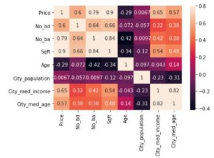
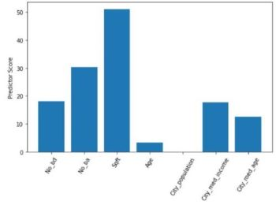
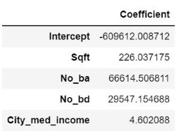
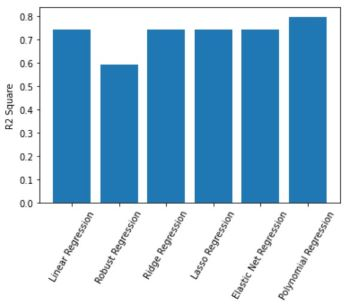
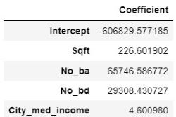

# 🏠 NoVA-Housing-Prices
```
Predicting housing prices for homes in Northern Virginia area using data scaped from Zillow.com listings
```
## 🔍 Background
Currently in the market for my first home, I decided I needed to do my research on the Northern Virginia (NoVA) housing market to supplement the info I've been gathering on my in-person search.

But beyond performing Exploratory Data Analysis on the prices and attributes of homes in 16 different suburbs of NoVA, I wanted to create a model to predict housing prices--namely through the use of various regression models.

## 🔢 Data
The 143 properties' data was scraped from Zillow using [webscraper.io](https://webscraper.io/), which allowed me to easily use a point-and-click interface to gather various facts from each listing.

If you want to use the tool yourself to scrape Zillow or data from any other website, refer to the guide I used found [here](https://medium.com/fortune-for-future/how-to-scrape-zillow-data-for-free-without-writing-any-code-be2ac698e604).

The results of my scraping can be found in the `housing_data` folder as .csv files for each suburb. The combining of the individual suburbs' data occurs in the following script.

## ➡ Getting Started
Start by setting up the appropriate environment to run a Jupyter Notebook file to ensure you have the proper versions of the required libraries. Once that is done, you can download the data and .ipynb file and hit "Run All" on the notebook.

## 🗺 Exploratory Data Analysis
Using Seaborne, HVplot and Matplotlib, I created visualizations to better understand the distribution of prices, as well as price's relationship with other important variables scraped from the listings.

The following show the statistics and distribution of home prices (after data cleaning was performed):


The relationship between price and other variables in the data is best shown using a correlation heatmap and a pairplot:




## 📈 Predicting House Prices using Regression Models
Regression analysis was chosen as the best type of model because we are predicting the continuous dependent variable of house prices from a number of independent variables.

In preparing the data for regression models, I had to ensure 1) DV is measured on a continuous level 2) Linearity between the DV and each IV 3) No multicollinearity 4) Normal distribution of residual errors 5) Homoscedasticity and 6) Independence of errors.

An intermediate step was feature selection. This was done using the `SelectKBest` method from SciKit Learn to select the 4 best features out of the 12 features scraped from listings, of which only 7 were meaningful. The results of the method are as follows, with Sqft (total square footage), No_ba (number of bathrooms), No_bd (number of bedrooms) and City_median_income (median income of the city in which the house is located) selected as the best using the `f_regression` function:



After applying the appropriate transformations to the selected variables to ensure linearity between DV and each IV, verifying variance inflation factors (VIF) of coefficients were less than 5 each to ensure no multicollinearity, checking a Q-Q plot of the model's residuals to ensure their normality, using a robust regression technique to account for heteroscedasticity, and checking that the Durbin-Watson value is around 2 to check for independence of errors, all assumptions were taken care of.

Once I split the data between training and test sets, the former was trained on 6 different types of regression models: Linear, Random Sample Consensus (RANSAC), Ridge, Lasso, Elastic Net and Polynomial. Linear regression was the baseline model upon which the other types were built, and the linear regression equation's intercept and coefficients are shown below, where we see that an increase in 1 square foot results in a $226.0 increase in home price, an extra bathroom results in a $66.6k increase, an extra bedroom results in a $29.5k increase, and an increase in $1 in the median income of the home's city corresponds to a $4.6 increase:



Evaluation of the 6 models is shown below:


Focusing on RMSE as the error metric to evaluate the 6 models, we see Polynomial Regression, followed by Elastic Net, performed the best:


Using R^2 as a goodness of fit measure, Polynomial Regression and Elastic Net, respectively, were also the best performing models:



The equation for the Polynomial Regression model, which has a degree of 2, has the following intercept ('const') coefficients for each feature combination (e.g. 'Sqft No_ba' is the variable 'Sqft' times 'No_ba'):


The equation for the Elastic Net Regression model has the below intercept and coefficients. This equation can be interpreted as an increase in 1 square foot results in a $226.6 increase in home price, an extra bathroom results in a $65.7k increase, an extra bedroom results in a $29.3k increase, and an increase in $1 in the median income of the home's city results in a $4.6 increase (overall pretty similar to what we see in the Linear Regression equation, but most coefficients are smaller, except for Sqft, due to the L1 and L2 penalties):



## ⏭ Takeaways and Next Steps

While a Polynomial Regression fit the data and reduced errors the best out of all 6 models, the Elastic Net Regression model was a lot easier to interpret for the purpose of my own house search (nothing super high stakes here). Based on the Elastic Net equation, and thus also the Linear Regression equations upon which it was built, one can tell the order of importance of certain features shown in Zillow listings, and the magnitude of which each affected the home's ultimate price. Square footage was obviously the most important feature, but using the models I can now tell exactly how much I should expect to pay for houses I'm interested in during the course of my search, given the size, number of bathrooms and bedrooms and the median income of the city in which it is located. 

As for next steps, the following four ideas are areas I can explore to take this project further:

A) Inspect whether models are overfit given low cross validation scores and why

B) Perform logistic regression to predict whether new data is categorized as "underpriced" or "overpriced" based on thresholds determined from the training data

C) Collect more data from other time periods to analyze cyclicality of prices--especially in this housing market, where we saw Zillow's algorithms fall short in being able to keep up with rapid price swings, ultimately leading to its recent layoffs and shuttering of its house-flipping business.
