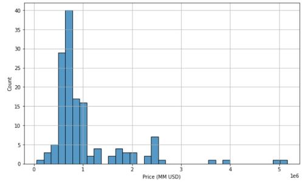

# 🏠 NoVA-Housing-Prices
```
Predicting housing prices for homes in Northern Virginia area using data scaped from Zillow.com
```
## 🔍 Background
Currently in the market for my first home, I decided I needed to do my research on the Northern Virginia (NoVA) housing market to supplement the info I've been gathering on my in-person search.

But beyond performing Exploratory Data Analysis on the prices and attributes of homes in 16 different suburbs of NoVA, I wanted to create a model to predict housing prices--namely through the use of various regression models.

## 🔢 Data
The 143 properties' data was scraped from Zillow using [webscraper.io](https://webscraper.io/), which allowed me to easily use a point-and-click interface to gather various facts from each listing.

If you want to use the tool yourself to scrape Zillow or data from any other website, refer to the guide I used found [here](https://medium.com/fortune-for-future/how-to-scrape-zillow-data-for-free-without-writing-any-code-be2ac698e604).

The results of my scraping can be found in the `housing_data` folder as .csv files for each suburb. The combining of the individual suburbs' data occurs in the following script.

## ➡ Getting Started
Start by setting up the appropriate environment to run a Jupyter Notebook file to ensure you have the proper versions of the required libraries. Once that is done, you can download the data and .ipynb file and hit "Run All" on the notebook.

## 🗺 Exploratory Data Analysis
Using Seaborne, HVplot and Matplotlib, I created visualizations to better understand the distribution of prices, as well as price's relationship with other important variables scraped from the listings.

The following show the statistics and distribution of home prices (after data cleaning was performed):




The relationship between price and other variables in the data is best shown using a correlation heatmap and a pairplot:

![]


## 📈 Predicting House Prices using Regression Models
Regression analysis was chosen as the best type of model because we are predicting the continuous dependent variable of house prices from a number of independent variables.

In preparing the data for regression models, I had to ensure 1) DV is measured on a continuous level 2) Linearity between the DV and each IV 3) No multicollinearity 4) Normal distribution of residual errors 5) Homoscedasticity and 6) Independence of errors.


